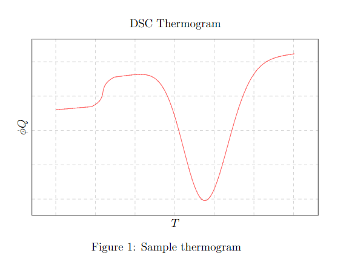

# DSC-Thermogram

Simple `fortran` script to generate `.dat` files for qualitatively modeling thermodynamic curing resin systems `(DGEBA-DDM)` to-be easily displayed using `\LaTeX` via `pgfplots`.

Inputs to alter the qualitative nature of the `thermogram`; range from the *vitreous transition temperature*, *peak temperature*, *activation energy*, *scanning range*, *specific heat*, *enthalpy*,... etc.

None of these inputs and outputs are really considered to be any accurate or representative of any *real* `DSC Thermogram`. This script is thought out for comparing different resin curing grades, transition temperatures, remaining reaction enthalpy in a qualitative manner. Nothing is to be measured.

Aside, the model used for generating such is rather crude and simple. Still, it is the shape of the function what matters.

Sample:



# How to Use

Download the code, namely in `lib`, the main fortran file, `main.f90`;

compile and run:

e.g. using the `gfortran` compiler in the system's console:

```
gfortran main.f90
```
An executable, `a.exe`, is generated. Execute in the console and follow the dialog instructions.

Upon termination of execution, a `.dat` file should be generated. This data can be easily viewed using `pgfplots` as follows:

```
\documentclass[12pt]{article}
\usepackage{tikz}
\usepackage{pgfplots}

\begin{document}

\begin{figure} [!h]\centering
\begin{tikzpicture}
\begin{axis}[]
    \addplot table {dsc.dat};
\end{axis}
\end{tikzpicture}
\end{figure}

\end{document}
```
